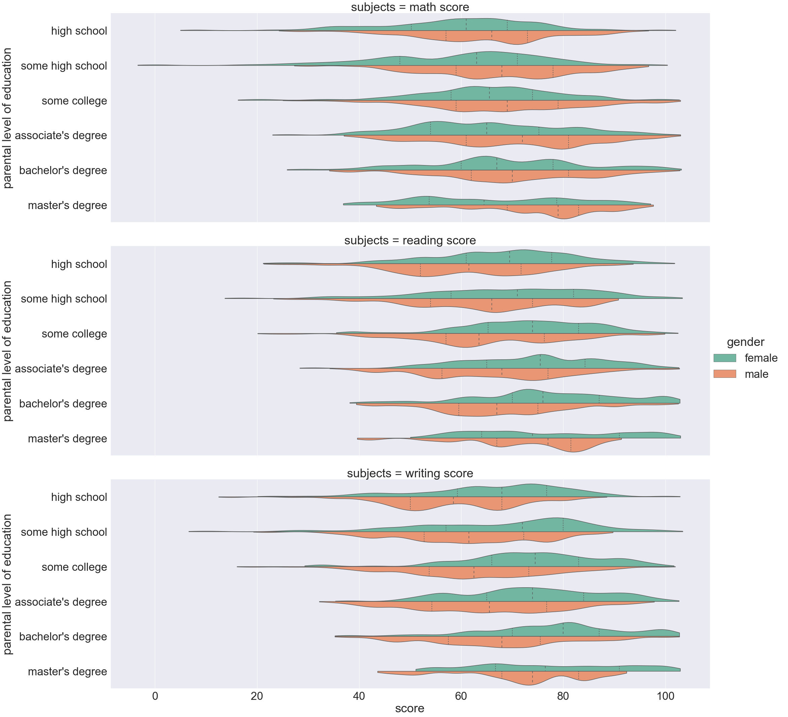
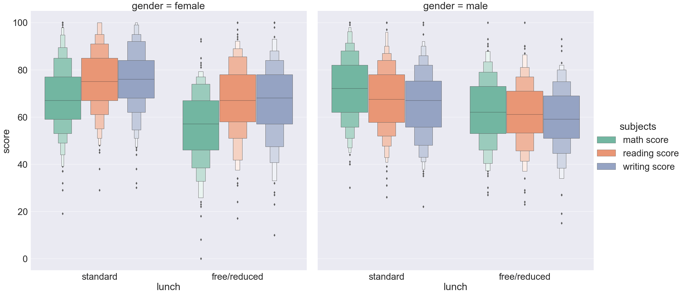

# Projects of Data Analysis
  Data analysis of Student exams profermance dataset by Python

  Interactive Dashboard of trend of video games by Excel PivotTable

## Data analysis of Student exams profermance dataset
Data analysis is also referred to as exploratory data analysis (EDA), which is one of core components of data science. By taking advantage of EDA, analysts can figure out the relationship between features and target variables, hence, data scientists, data engineers and data analysts spend their majority of time and effort to dig out those relationships. In the meantime, except discovering relationships, EDA can offer an opportunity to make smart decisions. This repository demonstrates the common steps and techniques of EDA. For the purpose of illustration and easy understanding, I used the Student Exams Performance dataset which has been taken from Kaggle(original resource as shown below).

Original resource: https://www.kaggle.com/spscientist/students-performance-in-exams

### Dataset Overview:
The dataset is downloaded from Kaggle and contains details of student exam scores from a public school.

The Student exams performance dataset collected 1,000 students' information, including three subjects’ scores and five factors which consists of personal, social  and economic details.

### Sample Dataset:

| Gender | race/ethnicity|parental level of education   |lunch | test preparation course |math score|reading score|writing score |
|:-------------:|:-------------:| :-------------:| :-------------:|:-------------:|:-------------:| :-------------:|:-------------:|
|female	|group B	|bachelor's degree	|standard	|none	| 72 |	 72 |	74 |
|female	|group C	|some college	|standard	|completed	| 69	|  90 |	88 |
|female	|group B	|master's degree |standard	|none	| 90	|  95 |	93 |
|male	|group A	|associate's degree	|free/reduced	|none	| 47 |	57  | 44 |
|male	|group C	|some college	|standard |none	| 76	|  78	| 75 |

#### More info:

Analysis folder contains the all of analysis procedures
1.dataset import
2.dataset's info check
3.data preparation
4.data analysis

RawData folder contains the raw dataset

### Features of Analysis

This figure gives the distribution of scores in different parental education backgrounds and student gender.

It is notable that male students have higher math scores when their parents had a higher level of education, but for reading and writing subjects, it is the other way around.

When it comes to female students, they could get greater scores on reading and writing exams, but they could not get the same results on math.

The figure illustrates the distribution of three subjects by different types of lunch  and gender.
All of the students who had standard lunch gained greater scores, there were more students whose scores excess 90 on all subjects.

If you enjoy it and want to check codes and other figures, it would be better to run the analysis file, there are all details of the whole comparison.

In addition, there is BrootStrap Resamping in this file, which is an application of Applied Statistics. Hope you enjoy it.

## Interactive Dashboard of trend of video games by Excel PivotTable
Interactive Dashboard is one of most convenient method to combine whold data analysis and present to your audiences. I made an interactive dashboard, contains the trend of video games from 1980 to 2020, through three individual Excel spreadsheets.

So you can run the PivotTable Project file and download Dashboard Project.xlsm to check dashboard, there is an instruction on the second sheet if you need it.

## Thank you for your time

